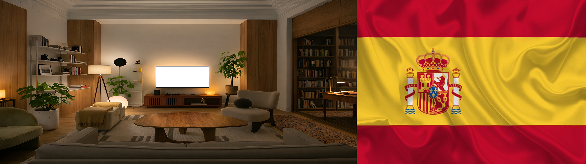

# GUIA PASO A PASO PARA IMPORTAR EL EFECTO DE `three.js` EN OTRA WEB

Igual que acabamos de hacer en esta carpeta `scroll`, es muy habitual querer reutilizar un efecto visual en otra etapa de una web.

Pero aqui hay una idea importante:

no estamos "animando un PNG".

Lo que hacemos realmente es montar una pequena escena 3D, pegar una imagen como textura sobre una malla y deformar esa malla en cada frame.

Por eso, para importar el efecto correctamente, no basta con copiar una imagen ni un solo archivo JavaScript.

Hay que copiar una secuencia completa de piezas, en un orden concreto.

## La idea general

El flujo final que hemos dejado funcionando es este:

1. crear una caja HTML para el efecto
2. dejar dentro una imagen fallback
3. dar a esa caja un CSS real con ancho y alto
4. escribir un archivo fuente del efecto en Three.js
5. usar la imagen como textura
6. generar un bundle final que ya lleva Three.js y la textura dentro
7. cargar ese bundle en la pagina

Ese es el camino correcto que un alumno debe seguir.

## Por que usamos un bundle final

Cuando quieres llevar este efecto a otra web, necesitas que el resultado final sea facil de cargar.

Por eso la estructura buena no es:

- cargar muchos archivos sueltos en el navegador

La estructura buena es:

- un archivo fuente editable
- un archivo final listo para usar

En este proyecto eso queda asi:

- `scrollbar-wave.mjs` es la fuente editable
- `scrollbar-wave.bundle.js` es el archivo final que se carga en la pagina

## Estructura final que debes tener

La version final que hemos montado en `scroll` se apoya en estos archivos:

- [index.html](/C:/Users/lorit/OneDrive/Escritorio/Landing-Contenidos/scroll/index.html)
- [styles.css](/C:/Users/lorit/OneDrive/Escritorio/Landing-Contenidos/scroll/styles.css)
- [scrollbar-wave.mjs](/C:/Users/lorit/OneDrive/Escritorio/Landing-Contenidos/scroll/scrollbar-wave.mjs)
- [scrollbar-wave.bundle.js](/C:/Users/lorit/OneDrive/Escritorio/Landing-Contenidos/scroll/scrollbar-wave.bundle.js)
- `scroll/assets/scrollbarlateral.png`

Si un alumno quiere repetir este montaje en su propia web, esas son las piezas que debe reproducir.

## Paso 1. Crea la caja HTML del efecto

Lo primero no es Three.js.

Lo primero es el hueco donde Three.js va a dibujar.

La caja que usamos en esta web es esta:

```html
<div
  class="horizontal-bar-wave"
  data-wave-scrollbar-stage
  data-wave-texture="./assets/scrollbarlateral.png"
  data-wave-aspect-ratio="3.5555555556"
  aria-label="Panoramica lateral con efecto ondulado en Three.js"
>
  
</div>
```

### Que hace cada parte

`class="horizontal-bar-wave"`

Esa es la caja visual del efecto.

`data-wave-scrollbar-stage`

Ese es el selector que busca el script para saber donde montar la escena.

`data-wave-texture`

Esa ruta indica que imagen quieres usar como textura base.

`data-wave-aspect-ratio`

Ese valor define la proporcion de la geometria.

En este caso usamos `3840 / 1080 = 3.5555555556`.

``

Esta imagen sirve como apoyo visual mientras el efecto se prepara.

Tambien sirve como referencia clara para el alumno: la textura original sigue existiendo en el DOM, y el canvas se monta encima.

## Paso 2. Dale un CSS real a la caja

Una escena WebGL necesita un area visible real.

Si la caja no tiene altura y ancho, el canvas no tiene donde dibujar.

Estas son las reglas que hemos dejado en esta web:

```css
.horizontal-bar-wave {
  position: relative;
  width: 100%;
  height: 100%;
  overflow: hidden;
  background:
    radial-gradient(circle at 20% 35%, rgba(255, 255, 255, 0.14), transparent 24%),
    radial-gradient(circle at 78% 42%, rgba(135, 176, 226, 0.12), transparent 28%),
    linear-gradient(180deg, #0b1622 0%, #07111a 100%);
  isolation: isolate;
}

.horizontal-bar-fallback {
  position: absolute;
  inset: 0;
  display: block;
  width: 100%;
  height: 100%;
  object-fit: cover;
  transition: opacity 0.35s ease;
}

.horizontal-bar-wave[data-wave-ready="true"] .horizontal-bar-fallback {
  opacity: 0;
}

.horizontal-bar-wave canvas {
  position: absolute;
  inset: 0;
  display: block;
  width: 100%;
  height: 100%;
  pointer-events: none;
  z-index: 1;
}
```

### La lectura correcta de este CSS

`.horizontal-bar-wave`

es la caja contenedora.

`.horizontal-bar-fallback`

es la imagen estatica que queda por debajo al principio.

`canvas`

es la capa que Three.js inserta encima.

`data-wave-ready="true"`

es la senal que usa el script para ocultar la imagen fallback cuando el efecto ya esta listo.

## Paso 3. Crea el archivo fuente del efecto

En esta web el archivo fuente es:

- [scrollbar-wave.mjs](/C:/Users/lorit/OneDrive/Escritorio/Landing-Contenidos/scroll/scrollbar-wave.mjs)

Ese archivo hace tres trabajos:

1. crea la escena de Three.js
2. crea la malla panoramica
3. deforma la malla en cada frame

## Paso 4. Importa Three.js y la textura en la fuente

En la fuente hemos dejado este arranque:

```js
import * as THREE from "../three.js/node_modules/three/build/three.module.js";
import inlineScrollbarTexture from "./assets/scrollbarlateral.png";
```

### Que significa esto

La primera linea importa el motor 3D.

La segunda importa la imagen de textura.

Esa segunda linea es importante porque despues, al generar el bundle, esa imagen puede quedar embebida dentro del archivo final.

Eso hace que la version final sea mucho mas portable.

## Paso 5. Selecciona la caja donde vas a montar la escena

En la fuente usamos este selector:

```js
const stageSelector = "[data-wave-scrollbar-stage]";
```

Y luego buscamos todas las cajas:

```js
const stages = Array.from(document.querySelectorAll(stageSelector));
```

### Por que asi

Esto permite que el mismo sistema pueda montar una o varias instancias si hiciera falta.

Para el alumno la idea es simple:

si el HTML y el selector no coinciden, el efecto no encuentra su caja.

## Paso 6. Crea el renderer, la escena y la camara

La base del efecto es esta:

```js
const renderer = new THREE.WebGLRenderer({
  antialias: true,
  alpha: true,
  powerPreference: "high-performance",
});

const scene = new THREE.Scene();
const camera = new THREE.PerspectiveCamera(18, 1, 0.1, 80);
camera.position.set(0.3, 0.02, 22);
```

### Que hace cada pieza

`WebGLRenderer`

crea el canvas donde se dibuja todo.

`Scene`

es el contenedor 3D general.

`PerspectiveCamera`

define desde donde miramos esa superficie ondulada.

## Paso 7. Anade las luces

Una textura deformada sin luz se lee mucho peor.

Por eso anadimos varias luces:

```js
const ambient = new THREE.AmbientLight(0xffffff, 1.35);
const keyLight = new THREE.DirectionalLight(0xffffff, 1.7);
const coolLight = new THREE.DirectionalLight(0x9fc4ff, 1.05);
const lowerFill = new THREE.PointLight(0xa4c7ff, 0.55, 45);
```

### Idea docente importante

La luz no crea la deformacion.

La luz hace visible la deformacion.

## Paso 8. Crea una malla con proporcion panoramica

Aqui esta una de las diferencias mas importantes respecto a la demo vertical de `three.js`.

En esta etapa lateral no usamos una proporcion estrecha, sino panoramica.

La base es esta:

```js
const aspectRatio = parseFloat(stage.dataset.waveAspectRatio || "3.5555555556");
const clothHeight = 5.8;
const clothWidth = clothHeight * aspectRatio;
const widthSegments = 230;
const heightSegments = 60;

const clothGeometry = new THREE.PlaneGeometry(
  clothWidth,
  clothHeight,
  widthSegments,
  heightSegments
);

clothGeometry.translate(clothWidth * 0.5, 0, 0);
```

### Que hay que explicar aqui

`clothWidth`

sale de la proporcion de la imagen.

`widthSegments` y `heightSegments`

definen cuantos vertices hay disponibles para doblar la superficie.

`translate(clothWidth * 0.5, 0, 0)`

desplaza la geometria para que el borde izquierdo actue como zona mas estable.

## Paso 9. Crea el material

El material que hemos dejado es este:

```js
const clothMaterial = new THREE.MeshStandardMaterial({
  side: THREE.DoubleSide,
  roughness: 0.9,
  metalness: 0.02,
});
```

Y luego montamos la malla:

```js
const clothMesh = new THREE.Mesh(clothGeometry, clothMaterial);
clothMesh.frustumCulled = false;
root.add(clothMesh);
```

### Que hay que explicar

`MeshStandardMaterial`

reacciona a la luz.

`DoubleSide`

evita perder la cara trasera si hay una ligera torsion.

`frustumCulled = false`

asegura que la malla no desaparezca por depender de un calculo automatico de visibilidad.

## Paso 10. Usa la textura importada

En la fuente final, la textura entra desde el import:

```js
const textureSource =
  !stage.dataset.waveTexture || stage.dataset.waveTexture === "./assets/scrollbarlateral.png"
    ? inlineScrollbarTexture
    : stage.dataset.waveTexture;
```

Y luego se aplica asi:

```js
new THREE.TextureLoader().load(
  textureSource,
  function handleTextureLoad(texture) {
    texture.anisotropy = renderer.capabilities.getMaxAnisotropy();
    texture.colorSpace = THREE.SRGBColorSpace;
    texture.wrapS = THREE.ClampToEdgeWrapping;
    texture.wrapT = THREE.ClampToEdgeWrapping;
    clothMaterial.map = texture;
    clothMaterial.needsUpdate = true;
    textureReady = true;
    stage.dataset.waveReady = "true";
    resize();
  }
);
```

### Que debe entender el alumno

La imagen no se pone en el HTML para animarla con CSS.

La imagen entra al material como textura 3D.

Cuando la textura ya esta lista:

1. se asigna al material
2. se marca la caja como `data-wave-ready="true"`
3. el fallback puede desvanecerse

## Paso 11. Guarda una copia de los vertices base

La deformacion nunca debe destruir la forma original.

Por eso guardamos esto:

```js
const positionAttribute = clothGeometry.attributes.position;
const positions = positionAttribute.array;
const basePositions = positions.slice();
```

### Idea clave

`positions`

es el array vivo que se modifica.

`basePositions`

es la copia estable desde la que recalculamos cada frame.

Sin eso, la geometria se iria deformando sobre una deformacion previa.

## Paso 12. Deforma la malla en cada frame

La logica central es esta:

```js
positions[i] = baseX + xOffset;
positions[i + 1] = baseY + yOffset;
positions[i + 2] = zOffset;
positionAttribute.needsUpdate = true;
clothGeometry.computeVertexNormals();
```

### Como explicarlo bien

No movemos la imagen.

Movemos los vertices de la superficie.

Y despues recalculamos las normales para que la luz siga entendiendo bien esa nueva forma.

## Paso 13. Usa varias ondas, no una sola

La deformacion que hemos dejado no depende de una unica formula.

Combina varias:

- `bellyWave`
- `secondaryWave`
- `flutterWave`
- `shimmerWave`
- `gustWave`
- `tailSnap`

### La idea didactica

Los movimientos naturales suelen salir de sumar varias deformaciones pequenas.

Asi se consigue que la superficie parezca viva y no mecanica.

## Paso 14. Haz responsive el efecto

Una superficie WebGL no debe quedarse con un tamano fijo.

Por eso el script usa una funcion `resize()` que:

1. mide la caja real
2. actualiza el renderer
3. actualiza la camara
4. recalcula la escala para cubrir bien el area visible

La base es esta:

```js
function resize() {
  const width = Math.max(stage.clientWidth, 1);
  const height = Math.max(stage.clientHeight, 1);

  renderer.setSize(width, height, false);
  camera.aspect = width / height;
  camera.updateProjectionMatrix();
}
```

Y despues:

```js
new ResizeObserver(resize).observe(stage);
```

### Que debe entender el alumno

No basta con que el canvas exista.

Tiene que adaptarse a la caja real donde vive.

## Paso 15. Espera a que la textura este lista antes de renderizar el resultado final

Hemos dejado una bandera de estado:

```js
let textureReady = false;
```

Y en la animacion:

```js
if (!textureReady) {
  return;
}
```

### Por que esto es importante

Primero preparas la escena.

Despues esperas a que la textura exista.

Y solo entonces das por listo el efecto visual final.

## Paso 16. Genera el bundle final

Esta es la parte mas importante para importarlo como lo hemos hecho en esta web.

No cargamos `scrollbar-wave.mjs` directamente en produccion final.

Generamos un bundle:

```powershell
npx --yes esbuild scroll\scrollbar-wave.mjs --bundle --format=iife --platform=browser --target=es2018 --loader:.png=dataurl --outfile=scroll\scrollbar-wave.bundle.js
```

### Que hace exactamente este comando

`--bundle`

une dependencias en un solo archivo.

`--format=iife`

genera un script clasico que el navegador puede cargar directamente.

`--loader:.png=dataurl`

convierte la imagen PNG en una URL embebida dentro del propio bundle.

`--outfile=scroll\scrollbar-wave.bundle.js`

crea el archivo final listo para usar.

## Paso 17. Carga en HTML solo el bundle final

En la pagina final, lo que se carga es esto:

```html
<script src="./scrollbar-wave.bundle.js"></script>
```

Eso es lo que hemos dejado en:

- [index.html](/C:/Users/lorit/OneDrive/Escritorio/Landing-Contenidos/scroll/index.html:363)

### La regla correcta

Fuente editable:

- `scrollbar-wave.mjs`

Archivo final para navegador:

- `scrollbar-wave.bundle.js`

## Paso 18. Si quieres llevarlo a otra web, copia este paquete

La forma correcta de importarlo como lo hemos hecho aqui es copiar estas piezas:

1. el bloque HTML del stage
2. el CSS del contenedor y del fallback
3. el archivo fuente `scrollbar-wave.mjs`
4. la imagen que quieres usar como textura
5. el comando de `esbuild`
6. el archivo final `scrollbar-wave.bundle.js`

## Paso 19. Si cambias de imagen, toca estas dos cosas

Cuando un alumno quiera usar otra imagen, debe ajustar:

1. la ruta de `data-wave-texture`
2. la proporcion `data-wave-aspect-ratio`

Ejemplo:

```html
<div
  class="horizontal-bar-wave"
  data-wave-scrollbar-stage
  data-wave-texture="./assets/mi-panorama.png"
  data-wave-aspect-ratio="1.7777777778"
>
  
</div>
```

Y despues debe regenerar el bundle.

## Paso 20. Orden correcto para repetir el ejercicio

Si un alumno quiere repetir el proceso desde cero, el orden correcto es este:

1. preparar el HTML del contenedor
2. preparar el CSS del contenedor
3. preparar la imagen base
4. escribir la fuente `scrollbar-wave.mjs`
5. importar Three.js y la textura en la fuente
6. montar renderer, escena, camara y luces
7. crear la geometria panoramica
8. aplicar la textura al material
9. deformar la malla en cada frame
10. generar `scrollbar-wave.bundle.js`
11. cargar ese bundle en la pagina

## Resumen corto para clase

Para importar este efecto a otra web como lo hemos hecho aqui, no hay que copiar "una animacion".

Hay que copiar una secuencia de trabajo:

1. crear una caja HTML
2. darle CSS real
3. montar una escena Three.js
4. usar una imagen como textura
5. deformar una malla panoramica
6. generar un bundle final con la textura embebida
7. cargar ese bundle en la pagina

Ese es el punto satisfactorio actual del proyecto.
